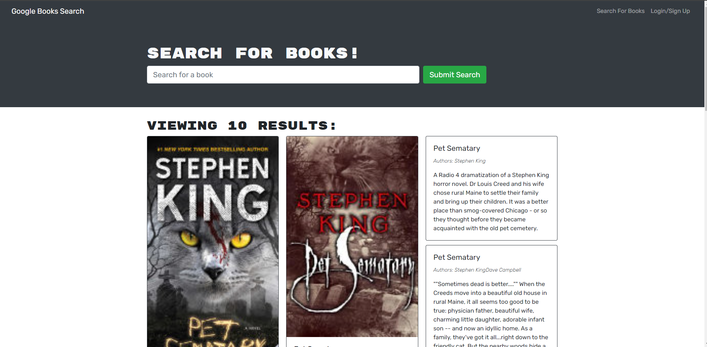

# Book Search Engine

## Table of Contents

- [Description](#description)
- [Installation](#installation)
- [Screenshot](#screenshot)
- [Deployed](#deployed)
- [Usage](#usage)
- [Licenses](#license)
- [Questions](#questions)
- [Credits](#credits)

## Description

This is a full stack web application using MERN Stack. This app allows users to search for books using the Google search API. This app was refactored to use GraphQL with Apollo.

## Installation

- Start by cloning the repo to your local machine.
- Run `npm install` to install all dependencies (This will install dependencies located in client, Server, and Root directory).
- cd into root directory and run `npm run develop` to start a local development server.

## Screenshot

## Deployed

Deployed application here:

## Usage

This app allows users to Login/Signup for an account. When a user has created an account they are allowed to search for books and save books to their personal list. Users can view their saved books as well as remove any books they wish to get rid of.

## Licenses

This project is covered under the MIT license. click the license button at the top to learn more.

https://opensource.org/licenses/MIT

## Questions

Questions regarding this project?
GitHub: https://github.com/Ryebread5555
Email: rypetty55@gmail.com

## Credits

- React.js
- JavaScript
- Node.js
- Express.js
- MongoDB
- Apollo
- GraphQL
- bcrypt
- Google Books API
